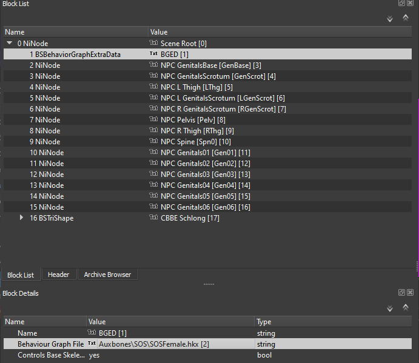
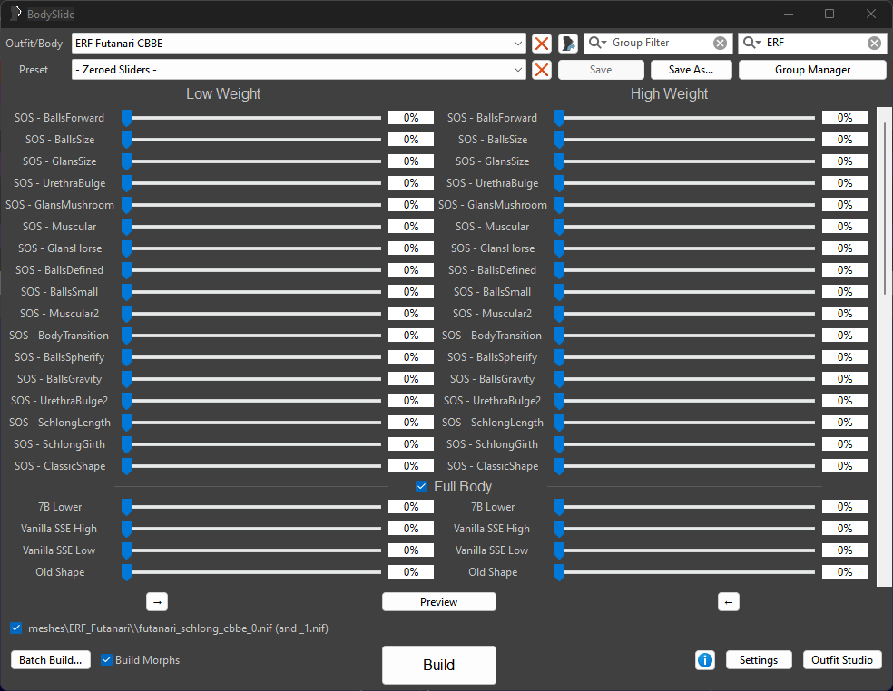

## So, Futa
Adding futa content to Licentia Black involves a little work, needing a basic understanding of using MO2.

 

First things first, futa addon mods are not compatible with Schlongs of Skyrim - Light that is used in Licentia Black.

**Swapping to the full version of Schlongs of Skyrim can apparently cause some issues with alignment of animations. By following this guide you acknowledge this issue and are okay with the potential of misaligned animations.**

Ok, onto the instructions.

### Step 1

Start by downloading [Schlongs of Skyrim SE 1.1.4 from LoversLab.](https://www.loverslab.com/files/file/5355-schlongs-of-skyrim-se/) Don't download the VR version, that definitely won't work.

In MO2, install it in the `Textures` category, below the existing SOS mod. In the FOMOD, select the following options:

1. Default Body
2. Hairless
3. Enable the other addons if you want

In the right pane of MO2, scroll all the way down and you should have 3 plugins below `Occlusion.esp`. 

- Move `Schlongs of Skyrim - Core.esm` to priority **109**, above `DynDOLOD.esm`.
- Move `Schlongs of Skyrim.esp` and any addon ESPs to priority **582** onwards.

*Ensure that `Schlongs of SkyrimSE - Light.esp` is UNCHECKED in the right pane of MO2!*

### Step 2

Next we need to replace the REALORE MEN'S texture with the SOS Full version. Download [**REALORE MEN'S - SOS Full**](https://www.nexusmods.com/skyrimspecialedition/mods/67029?tab=files) from the Nexus Mods page.

In MO2, install it in the `Textures` category, below the existing skin texture mod. In the FOMOD, choose the options that suit your preferences. Once installed, ensure it is checked and then uncheck `REALORE MEN'S- SOS Light`.

### Step 3

Download [SOS - Addon - Futanari CBBE SSE 1.1b](https://www.loverslab.com/files/file/11344-sos-addon-futanari-cbbe-sse/), [SOS - No Futanari Schlong - Addon 1.3](https://www.loverslab.com/files/file/13011-sos-no-futanari-schlong-addon/) and the following [Demoniac skin texture patch.](https://www.loverslab.com/topic/137830-easy-way-to-make-seamless-sos-textures/?do=findComment&comment=2908467)

Install the Futanari addon first, then the No Futanari Schlong addon and ensure they load *below* Schlongs of Skyrim in the left pane of MO2. In the right pane of MO2, scroll all the way down and you should have 3 plugins below `Occlusion.esp`. 

- Move all plugins to around **583**, below the SOS addon ESPs from earlier.

Next, install the skin texture patch and ensure it loads below the Futanari addon mod. Ensure it is checked.

### Step 4

Now, to make the Futanari addons work better with the OSex framework, there is some tweaking needed. For this you will need to [download a copy of NifSkope.](https://github.com/niftools/nifskope/releases/tag/v2.0.dev7) Extract it somewhere memorable and then launch it. 

From within NifSkope, click File > Open and then navigate to `Licentia Black\mods\SOS - Futanari CBBE SSE V1.1b\Meshes\ERF_Futanari` and open `futanari_schlong_cbbe_0.nif`.

In the dropdown list on the left, expand the first `NiNode` and the click on `BSBehaviourGraphExtraData`:

Towards the bottom, right click the field where it says `Auxbones\SOS\SOSFemale.hkx` and then click `Edit String Index`. In the pop-up window, change the text to:

`Auxbones\SOS\SOSMale.hkx` 

and then save. **Repeat these steps for the second mesh in the folder!**

### Step 5

In the left pane of MO2, scroll down and find the `BodySlide Output - LEAVE HERE AT THE END` category. Expand it and the right click > All Mods > Create an empty mod inside. When MO2 asks for a mod name, call it something along the lines of `[NoDelete] My Bodyslide Output`. Make sure it is checked before continuing.

Select BodySlide x64 in the executable dropdown menu and click Run.

In Bodyslide Studio, ensure that no groups are selected and filter using the top right text box by typing `ERF`. In the `Outfit/Body` selector, ensure that the ERF Futanari CBBE mesh is selected and in the `Preset` selector, ensure `- Zeroed Sliders -` is selected.

At the bottom left of Bodyslide, ensure to tick the box next to the `meshes\...` string and also to tick the box labelled `Build Morphs`. Hold Ctrl on your keyboard and click `Batch Build...` and then `Build`. From here, navigate to `Licentia Black\mods\[NoDelete] My Bodyslide Output` and then click `Select Folder`.

Once Bodyslide tells you the build was successful, click OK and close Bodyslide.

### Step 6

Time to launch Skyrim! Launch Licentia Black the same way as always and load into your save.

Head to the pause menu > Mod Configuration Menu and then scroll down to Schlongs of Skyrim. From this menu, head to the `Player / NPC Settings` sub-menu and change your selected schlong from here!

You may also wish to tweak the distribution chances in the lower sub-menus to allow for random NPC chances too. I recommend setting the Futa addon to ~5% and the No Futa addon to ~95%.

### Step 7

You may need to adjust your member in RaceMenu, mostly adjusting of Yaw values, to get proper alignment with the OSuite mods. Use the Vanity Mirror to do this and scroll across to the right to reach the Genitals menu.
