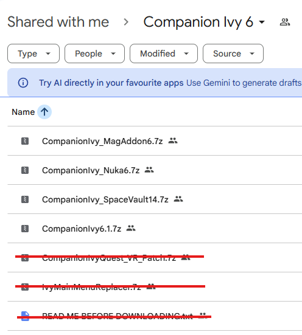
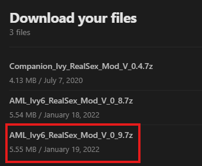
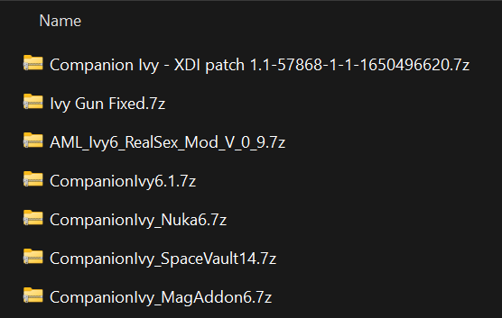
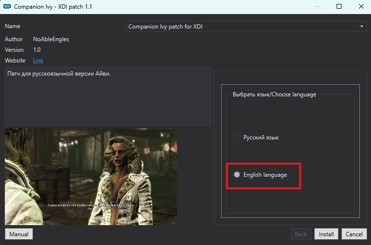
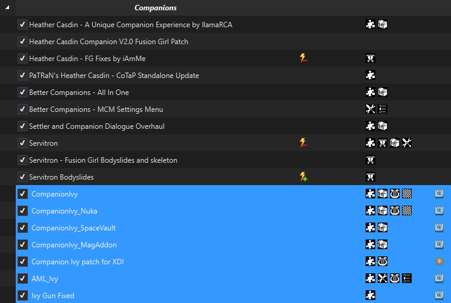
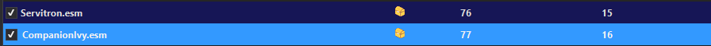
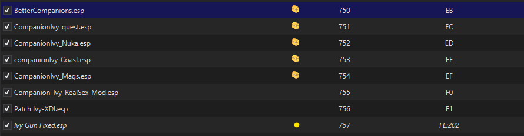
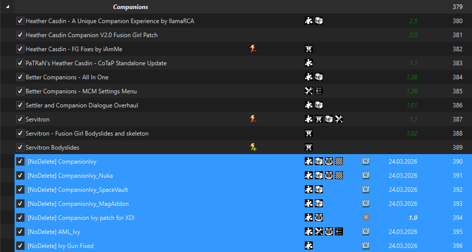
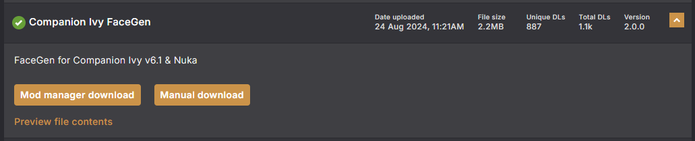

# Contents
{: .no_toc }

1. TOC
{:toc}

# Companion Ivy

{: .important}
>**Following this guide will result in a modified install, since you are going to add or remov mods from your install of WoD.**
>
>That means, if you ask for support in Discord, you will have to do so in #wod-modified, you are **NOT** eligible for regular support channels such as #wod-support.

Companion Ivy is probably the greatest companion mod ever made for Fallout 4.  
As far as depraved companions go, anyway.  

So have this warning right away:  
Ivy is very vulgar, very depraved and very sexually offensive.  
Some of the vulgarity can be disabled, but if that doesn't sound like your cup of tea, this mod isn't for you.

# Downloading required mods
First, you are going to download the required mods for integrating Ivy into WoD.  

## Google Drive (Main Files)
First, let's download Ivy and her addons.  
Head over to Ivy's [Loverslab page](https://www.loverslab.com/files/file/11260-meet-companion-ivy/) and grab the files that are not crossed out in the screenshot below:  

## Loverslab (Real Sex Mod)
Now, let's download the [AML_Ivy6_RealSex_Mod_V_0_9.7z](https://www.loverslab.com/files/file/13527-companion-ivy-realsex-mod/) file from Loverslab.  
This makes it so that having sex with her doesn't fade to black, but actually triggers a scene in NAF.  

## NexusMods (XDI Patch)
Download the XDI patch for Ivy from [NexusMods](https://www.nexusmods.com/fallout4/mods/57868).

{: .tip}
>There is conflicting information available about whether this mod is needed or not.  
>Some people claim they have played with Ivy wihtout it no problems, other seemed to have issues still, so your mileage may vary.
>
>Our recommendation is to just install it, it has no downsides if you do so.

## Hand Cannon Fix
By default, Ivy's gun is a bit defective in WoD.  
So you can either give her another gun that's in the list, or you can grab the [Fix for her original gun](assets/Ivy%20Gun%20Fixed.7z) by clicking the link.

## Verify you got everything
When you're down downloading, your Download directory should look something like this:  

# Installing and sorting all the mods
Now that we have downloaded everything, it's time to install and sort (overwriting / load order) the mods.

## Installing
Just install all the mods in MO2.  
The order in which you are going to install the mods does not matter now, as we will sort them later.

When installing the XDI patch, make sure you select the "English Language" option, as shown below:  

## Overwriting / Left Pane
When you are done installing, all your new mods will be listed in the scary red separator in MO2.  
Don't worry, that's normal as MO2 always puts newly installed mods at the bottom of the list.

You are allowed to touch the mods in the separator.  
**JUST THIS ONCE.**

Sorting the mods here is simple, you're just gonna drag all the mods at the bottom of the "Companions" separator.  
**It's important that you place them in the exact order as shown in the screenshot:**  

## Load Order / Right Pane
Now, the right pane is a bit trickier, for the single reason that Ivy has a master plugin (.esm) as well as normal plugins (.esp / .esl) files.

First of all, don't forget to **enable all the mods you just installed**, otherwise you won't find them in the right pane.

{: .tip}
>I'm assuming you are playing on the "Give Me Pain" profile here, because honestly, that is the profile you should be playing on. 
>
>If you are playing on another profile, shame on you, but you'll just have to adapt accordingly, your plugin positions will vary slightly.

## ESM position
You're gonna put the .esm file just below the other .esm files of the "Companions" section.  
In my case, that is below Servitron, like shown below:  

## ESP positions
Again, just like the .esm, we are going to put the .esp files just after the other .esps of the "Companions" section.  
**It's important once again, that you put the files in this exact order:**  

# Making Ivy update-safe

{: .tip}
>This section is optional.  
>If you follow this, it makes Ivy "persistant" if you have to reset or want to upgrade your modlist.  
>
>**If you don't do this, Ivy will be deleted if you re-run Wabbajack over your install.**

Just add `[NoDelete]` **before** of all the mod names in MO2 like so:  

# Ivy has no face!
As of now, this is a known bug, and it has two possible solutions.  
Although both have their caveats, you only need to chose one.

## 1. Change her hairstyle  
Open the console, and click on her, so that the top of the console displays her ID and name.  
Then press F3 -> Looks -> Show Looks Menu and change her hairstyle. Her head should now be visible.

{: .caution}
>This only works **AFTER** you have shown her your voucher and left her place.

## 2. Install the Wonderglue patch
Download and install the [Wonderglue patch](https://www.nexusmods.com/fallout4/mods/86384?tab=files) from Nexus.  
You'll have to scroll down a bit to find it.  

Install it in MO2 and place it AFTER all the other Ivy mods at the bottom of the companion stuff, both on the left and the right pane.

{: .caution}
>If you want to start a new game, you will have to **disable this mod first**, otherwise your game might crash before you load into the bathroom.  
>You can enable it again once you are spawned into the wasteland.